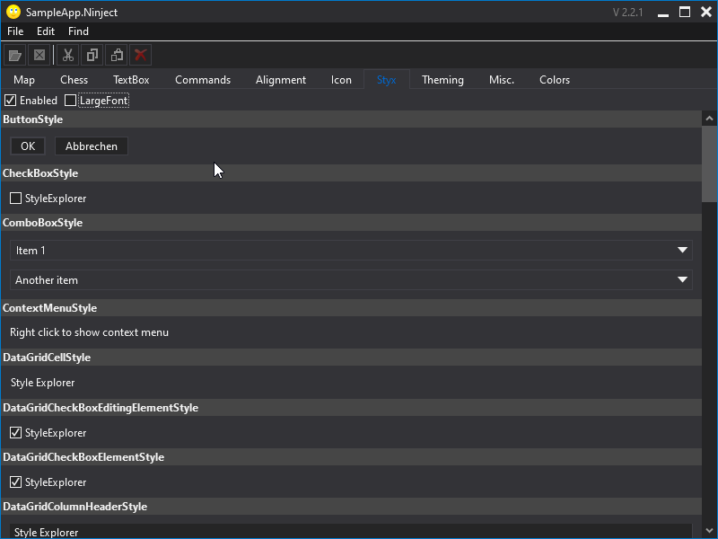

# TomsToolbox.Wpf.Styles

This package provides themeable modern styles for most standard WPF controls like `Window`, `Button`, `TextBox`, etc.

## Usage
Using the styles is very simple. You do not have to include special resource dictionaries or use special derived versions of the controls. Simply add one line to your applications startup method:

```c#
public sealed partial class App : IDisposable
{
    protected override void OnStartup(StartupEventArgs e)
    {
        base.OnStartup(e);

        Resources.MergedDictionaries.Insert(0, WpfStyles.GetDefaultStyles().RegisterDefaultWindowStyle());
    }
```

### Using individual resources explicitly
To reference individual styles explicitly, either to force a style for a certain control or to create a derived style to add individual functionality, the styles library provides strong typed keys for all elements.

The keys you can find in the `TomsToolbox.Wpf.Styles.ResourceKeys` class. Since all keys are strong typed, intellisense will guide you to easily find the desired key while building your UI.

To reference a resource, the key is used via the "Static" markup extension:

```xml
<RootElement                    
    xmlns="http://schemas.microsoft.com/winfx/2006/xaml/presentation"
    xmlns:x="http://schemas.microsoft.com/winfx/2006/xaml"
    xmlns:styles="urn:TomsToolbox.Wpf.Styles">
 
    <Button Style="{DynamicResource {x:Static styles:ResourceKeys.ButtonStyle}}" />
```

## Preview
Find a preview of all available styles in the Style Explorer tab of the sample app:

